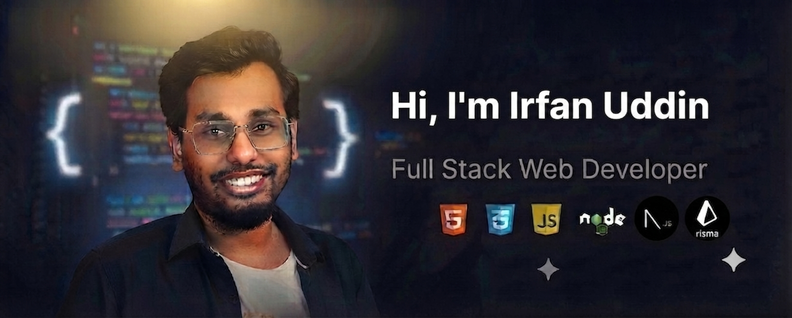

  

<h1 align="center">Hi 👋, I'm Irfan Uddin</h1>

<h3 align="center">
Full Stack Web Developer | MERN Stack Developer | Backend Enthusiast
</h3>

---

## 👨‍💻 About Me

I'm a passionate Full Stack Web Developer who enjoys building modern, scalable, and user-friendly web applications.

I love working with JavaScript, TypeScript, React, Next.js, Node.js, Express.js, PostgreSQL, and Prisma. I'm always eager to learn new technologies and improve my problem-solving skills.

---

## 🚀 Current Activities

- 🌱 Currently learning **Backend Architecture & System Design**
- 💻 Building modern **Full Stack Web Applications**
- 🔥 Exploring **Next.js 15**
- ⚙️ Learning **Prisma ORM & PostgreSQL**
- 🎯 Improving problem-solving and clean code practices

---

## 🛠️ Languages & Tools

---

## 📫 Contact Me

📧 **Email**

mdirfansayid@gmail.com

📍 **Location**

Cairo, Egypt

---

## 🌐 Connect with Me

---

## 📊 GitHub Stats

<!-- 

 -->
<!-- 

 -->

---

## ⚡ Fun Fact

> I enjoy solving programming problems and building real-world web applications that make people's lives easier.
